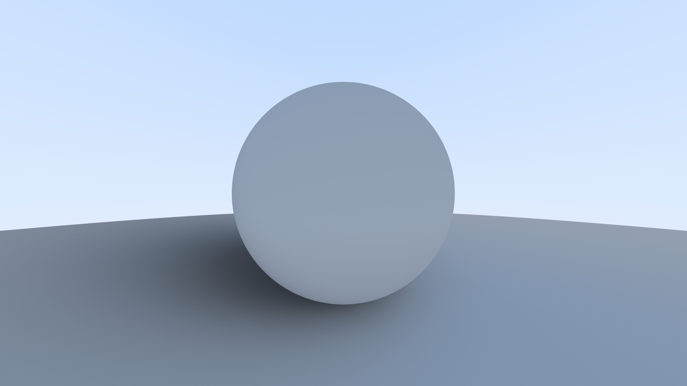

# Ray tracer

A simple ray tracer written in rust. 

# TODO

- Rewrite "lib" into a single module with submodules
- Learn about ownership, lifespan etc
- Rewrite to use pointers in genera
- Implement material

# Spotlight

