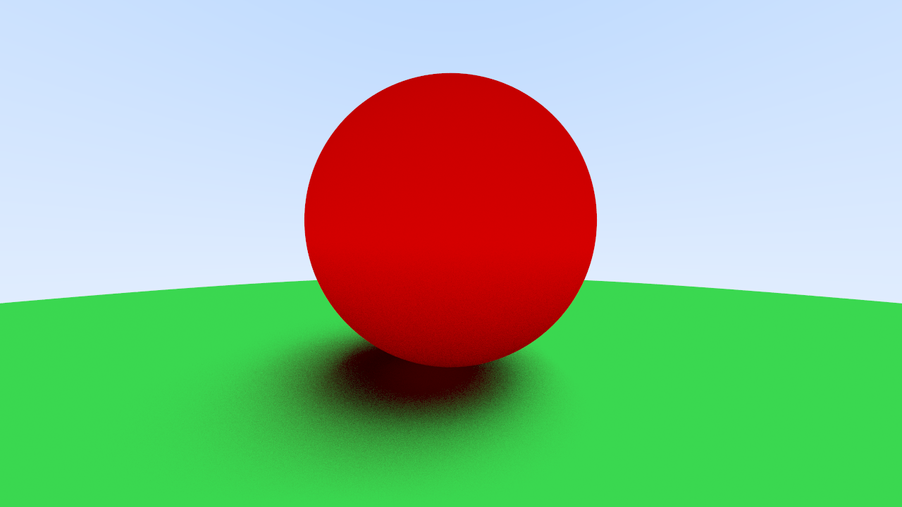

# Rayo

A ray tracer implementation written in rust. Inspired by the amazing book: [_Ray Tracing in One Weekend_](https://raytracing.github.io/books/RayTracingInOneWeekend.html)

# Spotlight

Here is a gallery of some of the best renders:


# Usage

Rayo is (currenty) a command line tool. The available flags and options are:

```
USAGE:
    rayo [OPTIONS] <SCENE>

FLAGS:
    -h, --help       Prints help information
    -V, --version    Prints version information

OPTIONS:
    -a, --aspect <ASPECT-RATIO>        Aspect ratio [default: 16/9]
    -d, --depth <MAX-DEPTH>            Maximum recursion depth [default: 30]
    -n, --num-samples <NUM-SAMPLES>    Number of samples per pixel [default: 100]
    -o, --out <FILE>                   Rendered image path [default: render.png]
    -r, --resolution <RESOLUTION>      Horizontal image resolution [default: 480]

ARGS:
    <SCENE>    The Scene JSON file
```

To create a render you need to create a corresponding scene file defining the positions, shapes and colors of all of the models in the scene. An example scene file is:

```json
{
    "spheres": [
        {
            "center": [0, 0.1, -1],
            "radius": 0.5,
            "material": {"type": "lambertian", "albedo": [1, 0, 0]}
        },
        {
            "center": [0, -100.5, -1],
            "radius": 100,
            "material": {"type": "lambertian", "albedo": [0.1, 1, 0.1]}
        }
    ]
}
```

Which produces the following render:



# Features

Many features are yet to be implemented

- [x] Nice CLI
- [ ] Reading scenes from json or some other similar format
- [ ] Support for OBJ files for meshes

## Shapes

- [x] Spheres
- [ ] Axis aligned boxes
- [ ] Triangle meshes

## Materials

- [x] Lambertian diffuse materials
- [x] Metalic materials
- [ ] Glass and Dielectrics

## Effects

- [x] Anti aliasing
- [ ] Depth of field
- [ ] Motion blur 
- [ ] Adjustable camera positions

## Efficiency enhancements

- [x] parallelize on CPU
- [ ] parallelize on GPU
- [ ] bounding volumes

## Possible things but unlikely

- make an opengl viewer which allows you to set up scene and then switch to raytraced mode
- compile this to webgl and wasm and run in browser?

