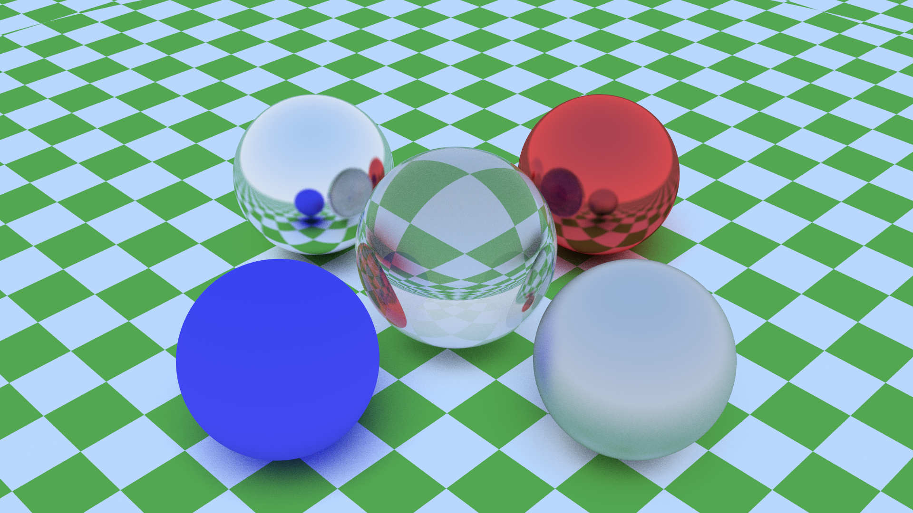

# Rayo

A path tracer written in rust. Inspired by the amazing  [_Ray Tracing in One Weekend_](https://raytracing.github.io/) book series.

# Renders




# Usage

`rayo` is (currenty) a command line tool. The available flags and options are:

```
USAGE:
    rayo [OPTIONS] <SCENE>

FLAGS:
    -h, --help       Prints help information
    -V, --version    Prints version information

OPTIONS:
    -a, --aspect <ASPECT-RATIO>        Aspect ratio [default: 16/9]
    -d, --depth <MAX-DEPTH>            Maximum recursion depth [default: 30]
    -n, --num-samples <NUM-SAMPLES>    Number of samples per pixel [default: 100]
    -o, --out <FILE>                   Rendered image path [default: render.png]
    -r, --resolution <RESOLUTION>      Horizontal image resolution [default: 480]

ARGS:
    <SCENE>    The Scene JSON file
```

To create a render you need to create a corresponding scene file defining the positions, shapes, materials and textures of all of the models in the scene. A collection of example scenes can be found in the `scenes` folder.

# Features

Many features are yet to be implemented. The basic roadmap is:

- [x] Nice CLI
- [x] Reading scenes from json or some other similar format
- [ ] Support for OBJ files for meshes (using assimp)

## Shapes

- [x] Spheres
- [ ] Axis aligned boxes
- [ ] Triangle meshes
- [ ] Planes

## Materials

- [x] Lambertian diffuse materials
- [x] Metalic materials
- [x] Glass/Dielectrics

## Effects

- [x] Anti aliasing
- [x] Depth of field
- [ ] Skyboxes
- [ ] Motion blur 
- [x] Adjustable camera positions
- [x] Textures (checkerboard)
- [ ] Textures (reading from image)
- [x] Light objects

## Efficiency enhancements

- [x] parallelize on CPU
- [ ] parallelize on GPU (cuda)
- [ ] bounding volumes

## Possible things but unlikely

- make an opengl viewer which allows you to set up scene and then switch to raytraced mode
- have this viewer display the render after each sample
- compile this to webgl and wasm and run in browser?

