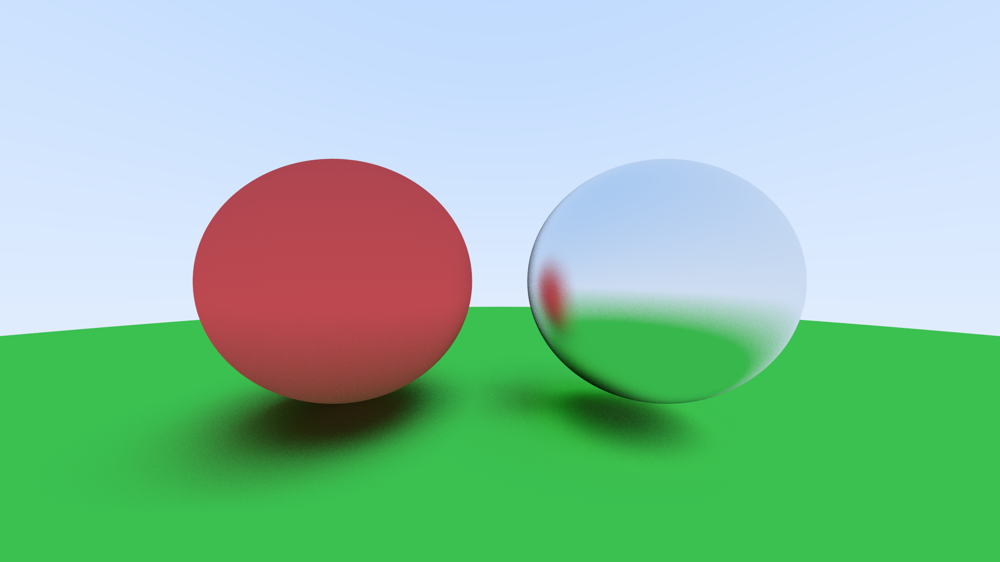

# Rayo

A ray tracer implementation written in rust. Inspired by the amazing book: [_Ray Tracing in One Weekend_](https://raytracing.github.io/books/RayTracingInOneWeekend.html)

# Spotlight

# Features

Many features are yet to be implemented

- [ ] Nice CLI
- [ ] Reading scenes from json or some other similar format

## Shapes

- [x] Spheres
- [ ] Axis aligned boxes
- [ ] Triangle meshes

## Materials

- [x] Lambertian diffuse materials
- [x] Metalic materials
- [ ] Glass and Dielectrics

## Effects

- [x] Anti aliasing
- [ ] Depth of field
- [ ] Motion blur 

## Efficiency enhancements

- [x] parallelize on CPU
- [ ] parallelize on GPU
- [ ] bounding volumes

